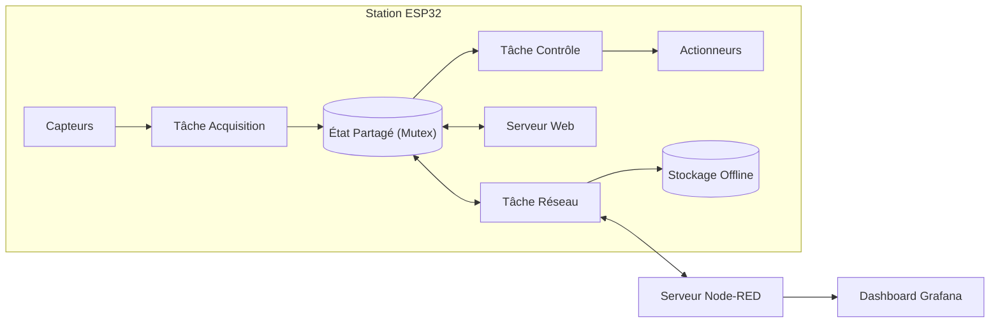

# Architecture du Système IoT

Ce document présente l'architecture matérielle et logicielle de la station de supervision IoT.

## 1. Vue d'ensemble logicielle

Le système repose sur **FreeRTOS** pour garantir le fonctionnement en temps réel et la séparation des tâches critiques (acquisition, contrôle) des tâches secondaires (réseau, interface web).

## 2. Découpage des tâches (FreeRTOS)

Le système est découpé en tâches indépendantes avec des priorités distinctes pour éviter tout blocage :

| Tâche | Période | Priorité | Rôle principal |
| --- | ---: | ---: | --- |
| `acquisitionTask` | 2000 ms | 3 (Haute) | Lecture, filtrage et horodatage des capteurs. |
| `controlTask` | 50 ms | 4 (Critique) | Gestion des sécurités (bouton d'arrêt) et pilotage des actionneurs. |
| `networkTask` | 100 ms | 2 (Moyenne) | Reconnexion WiFi/MQTT et publication des données. |
| `webTask` | 10 ms | 1 (Basse) | Interface de configuration locale. |
| `supervisorTask` | 1000 ms | 1 (Basse) | Surveillance de l'état système (RAM, Uptime). |

## 3. Communication MQTT et Mode Hors-ligne

- **Topic de télémétrie** : `campus/<groupe>/<deviceID>/data` (QoS 1)
- **Topic de commandes** : `campus/<groupe>/<deviceID>/cmd`
- **Résilience** : En cas de coupure réseau, les trames JSON sont sauvegardées localement dans la mémoire flash (LittleFS). Elles sont retransmises automatiquement au retour de la connexion.

## 4. API Locale et Interface Web

L'interface web embarquée (accessible sur le port 80) permet de configurer le broker MQTT et de visualiser les données en direct sans dépendre du serveur externe.
L'API est sécurisée par une authentification basique (`operator` / `reactor`).

## 5. Câblage (Pinout ESP32)

| Composant | GPIO | Rôle |
| --- | ---: | --- |
| **Capteurs** | | |
| DS18B20 | 4 | Température coeur (OneWire) |
| DHT22 | 21 | Température/Humidité ambiante |
| HW-486 | 34 | Capteur de luminosité (Analogique) |
| Encodeur | 18,19,5 | Contrôle des barres (CLK, DT, SW) |
| **Actionneurs** | | |
| Servo SG90 | 13 | Position barres (PWM) |
| LEDs R/V/B | 25,26,27| Indication d'état (Numérique) |
| Buzzer | 14 | Alarme sonore |

