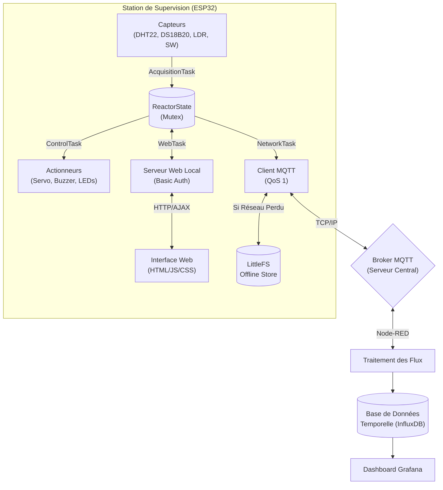

# Architecture du Système IoT : Station de Supervision

**Groupe :** Mehdi CHEDAD, Anis Hammoudi, Sanaa Zouine

Ce document présente l'architecture matérielle et logicielle détaillée de la station de supervision IoT (simulation de réacteur) fonctionnant sur ESP32.

## 1. Modularité Logicielle

Le projet est conçu sans code monolithique. La boucle `loop()` principale est vide. Toute la logique métier est découpée en modules au sein du dossier `src/` :

*   `src/sensors/` : Classes de filtrage (EMA) et d'abstraction des capteurs (`DHT22`, `DS18B20`, Encodeur, Capteur de lumière).
*   `src/actuators/` : Classes de pilotage des sorties matérielles (`Servo SG90`, `Buzzer`, `LEDs RGB`).
*   `src/network/` : Gestionnaires asynchrones pour le `WiFi` et le `MQTT` (reconnexion automatique, QoS 1).
*   `src/storage/` : Implémentation du mode hors-ligne via `LittleFS` (`OfflineStore.cpp`).
*   `src/web/` : API locale sécurisée et gestionnaire du serveur Web (`WebServerManager.cpp`).
*   `src/models/` : Structures de données globales (ex: `ReactorState`) sécurisées par un Mutex.

## 2. Diagramme d'Architecture Système

Le flux de données s'écoule des capteurs vers l'interface locale et le Cloud, tout en passant par des verrous de sécurité (Mutex) et des systèmes de résilience (Offline Store).

## 3. Ordonnancement FreeRTOS (Temps Réel)

Le système est découpé en tâches indépendantes. Le *scheduler* préemptif de FreeRTOS garantit que les tâches critiques (Contrôle/Sécurité) ne sont jamais bloquées par des lenteurs réseau.

| Tâche (Task) | Période | Priorité | Rôle principal |
| --- | ---: | ---: | --- |
| `acquisitionTask` | 2000 ms | 3 (Haute) | Lecture, filtrage exponentiel (EMA) et horodatage des valeurs matérielles. |
| `controlTask` | 50 ms | 4 (Critique) | Gestion instantanée des sécurités (Arrêt d'urgence) et des actionneurs. Préempte tout le reste. |
| `networkTask` | 100 ms | 2 (Moyenne) | Reconnexion réseau, publication MQTT et dépilement de la queue hors-ligne. |
| `webTask` | 10 ms | 1 (Basse) | Service des requêtes API locales. |
| `supervisorTask` | 5000 ms | 1 (Basse) | Surveillance des constantes vitales du système (RAM disponible, Uptime). |

> [!IMPORTANT]  
> Chaque tâche utilise l'instruction non-bloquante `vTaskDelayUntil()`. Cela empêche la famine (*Starvation*) des tâches de priorité inférieure et permet au Watchdog Timer matériel de respirer.

## 4. Communication Réseau et Résilience

*   **Télémétrie MQTT** : La station publie ses mesures sur le topic `campus/<groupe>/<deviceID>/data`.
*   **Commandes** : La station écoute les ordres extérieurs sur le topic `campus/<groupe>/<deviceID>/cmd` (avec validation stricte des trames JSON entrantes).
*   **Mode Hors-Ligne** : En cas de perte de connectivité (WiFi défaillant, Broker down), la `networkTask` écrit les données de télémétrie sur la mémoire Flash (partition LittleFS) via `OfflineStore`. Dès le rétablissement du réseau, les paquets JSON stockés sont retransmis.

## 5. Interface Locale et Sécurité

*   **Interface Web** : Hébergée sur l'ESP32 via les fichiers `/data/index.html`, `app.js` et `style.css`.
*   **Sécurité des API** : Tous les points de terminaison (`/api/command`, `/api/config/mqtt`) nécessitent une authentification HTTP (`operator` / `reactor`).

## 6. Câblage Matériel (Pinout ESP32)

| Composant | GPIO | Rôle |
| --- | ---: | --- |
| **Capteurs** | | |
| HW-486 | 34 | Capteur de luminosité (Analogique - Vérification présence/ouverture) |
| DS18B20 | 4 | Température coeur (Bus OneWire) |
| DHT22 | 21 | Température et Humidité de la salle de contrôle |
| Encodeur Rotatif | 18, 19, 5 | Contrôle des barres (CLK, DT) et acquittement/urgence (SW) |
| **Actionneurs** | | |
| Servo SG90 | 13 | Position d'insertion des barres de contrôle (Signal PWM) |
| Buzzer HW-508| 14 | Alarme sonore en cas de criticité thermique |
| LEDs RGB | 25, 26, 27| Affichage rapide de l'état système (Nominal, Avertissement, Critique) |
